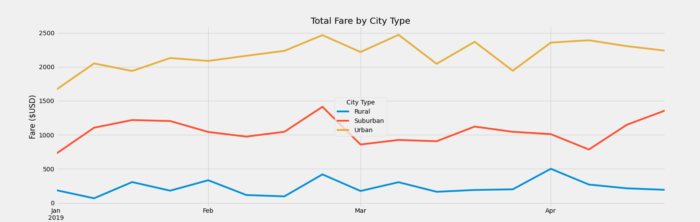

# PyBer_Analysis

# Background and Results
PyBer is a ride-sharing app company valued at $2.3 billion. In this analysis we are performing two technical analyses to create visualizations of rideshare data to help improve access to ride-sharing services  

## Technical Analysis 1- a summary DataFrame of the key metrics for the ride-sharing data  by city type 
The technical deliverables were analyzed in:
### DataFrame, where for each city type we calculated: 
    Total Rides, 
    Total Drivers, 
    Total Fares, 
    Average Fare per Ride,
    Average Fare per Driver
    
|          |   Total Rides |   Total Drivers | Total Fares   | Average Fare per Ride   | Average Fare per Driver   |
|:---------|--------------:|----------------:|:--------------|:------------------------|:--------------------------|
| Rural    |           125 |              78 | $4,327.93     | $34.62                  | $55.49                    |
| Suburban |           625 |             490 | $19,356.33    | $30.97                  | $39.50                    |
| Urban    |          1625 |            2405 | $39,854.38    | $24.53                  | $16.57      
    
This DataFrame shows us that the most rides with the most drivers we can find in the Urban city typer, the least in the Rural, but the highest average fare per ride and per drivers are in the Rural city types. Urban city types has 13 times more rides than Rural and 2.6 times more that in Suburban. Which translate to the highest Total Fares for Urban city types.

## Technical Analysis 2 – the technical deliverables were analyzed: 
### in the Pivot table:  
where the total fares per week for each city type were calculated. Based on this Pivot table multiple-line graph was produced.

| Date                |   Rural |   Suburban |   Urban |
|:--------------------|--------:|-----------:|--------:|
| 2019-01-06 00:00:00 |  187.92 |     721.6  | 1661.68 |
| 2019-01-13 00:00:00 |   67.65 |    1105.13 | 2050.43 |
| 2019-01-20 00:00:00 |  306    |    1218.2  | 1939.02 |
| 2019-01-27 00:00:00 |  179.69 |    1203.28 | 2129.51 |
| 2019-02-03 00:00:00 |  333.08 |    1042.79 | 2086.94 |
| 2019-02-10 00:00:00 |  115.8  |     974.34 | 2162.64 |
| 2019-02-17 00:00:00 |   95.82 |    1045.5  | 2235.07 |
| 2019-02-24 00:00:00 |  419.06 |    1412.74 | 2466.29 |
| 2019-03-03 00:00:00 |  175.14 |     858.46 | 2218.2  |
| 2019-03-10 00:00:00 |  303.94 |     925.27 | 2470.93 |
| 2019-03-17 00:00:00 |  163.39 |     906.2  | 2044.42 |
| 2019-03-24 00:00:00 |  189.76 |    1122.2  | 2368.37 |
| 2019-03-31 00:00:00 |  199.42 |    1045.06 | 1942.77 |
| 2019-04-07 00:00:00 |  501.24 |    1010.73 | 2356.7  |
| 2019-04-14 00:00:00 |  269.79 |     784.82 | 2390.72 |
| 2019-04-21 00:00:00 |  214.14 |    1149.27 | 2303.8  |
| 2019-04-28 00:00:00 |  191.85 |    1357.75 | 2238.29 |

### in multible-line graph that shows the total fares for each week by each city type
Pivot table and multiple-line graph shows us Total Fares by City Type over the period of four months with the sum of the fares for each week

Looking at the pivot table and graph we can say that Urban cities has the highest sums of the fares, it confirms our findings from the DataFrame in part one. We can see few peaks on the graph, it could be worth of exploring what caused them.

# Challenges and Diffculties:
Challenges and diffculties in this modul's were overcomed by exploring new methods like loc, resample() and using pivot table. Also by going back to the previous challenge where we used method groupby, which was crucial for solving this challenge. Trying to decompose the problem helped to create steps that led to the final graph.

# Recomendation:
For further recommendation I would recommend analyzing more data, we could see a significant difference in average fare per ride and average fare per rider, but I would assume that it could be caused by the length of the ride city versus rural areas.
This could be achieved for example by creating another pivot table and graph with mileage per ride for each city type.

I would strongly recomend additional analyse based on the day of the week, if we could see some trends there and analyse with the mileage of each ride.

